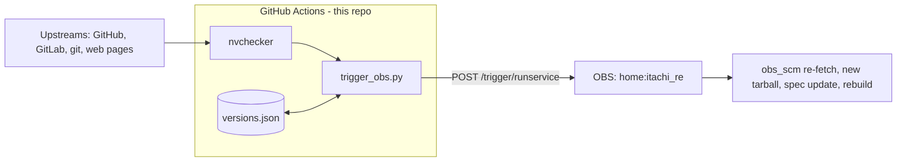
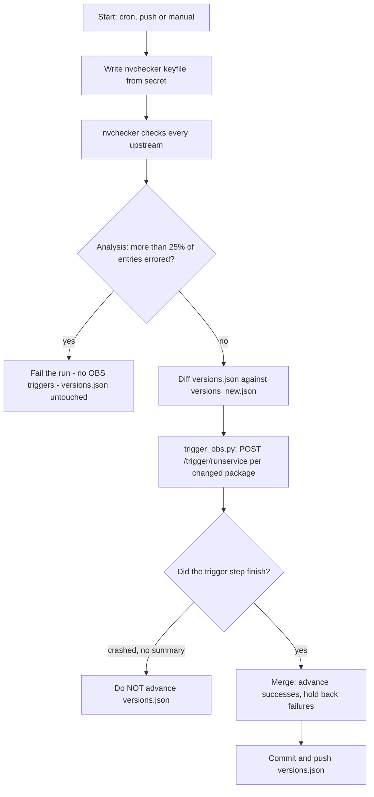

# OBS Auto-Trigger

[](https://github.com/itachi-re/obs-auto-trigger/actions/workflows/check-updates.yml)
<!-- Status -->
[](https://github.com/itachi-re/obs-auto-trigger/actions/workflows/check-updates.yml)
[](https://github.com/itachi-re/obs-auto-trigger/commits/main)
[](https://github.com/itachi-re/obs-auto-trigger/graphs/commit-activity)
[](https://github.com/itachi-re/obs-auto-trigger/issues)

<!-- Project -->
[](https://build.opensuse.org/project/show/home:itachi_re)
[](nvchecker.toml)
[](.github/workflows/check-updates.yml)

<!-- Tech -->
[](https://nvchecker.readthedocs.io/)
[](https://www.python.org/)
[](https://github.com/features/actions)

<!-- Community -->
[](https://github.com/itachi-re/obs-auto-trigger/stargazers)
[](LICENSE)

Automated upstream version tracking for **100+ packages** in the openSUSE Build Service (OBS)
project `home:itachi_re`. A GitHub Actions cron job checks every upstream with
[nvchecker](https://nvchecker.readthedocs.io/), and the moment a new version appears it fires an
OBS service run (`obs_scm` re-fetch) for that package, so OBS rebuilds without any manual work.



---

## Table of Contents

1. [How it works](#how-it-works)
2. [Safety guarantees](#safety-guarantees)
3. [One-time setup](#one-time-setup)
4. [Day-to-day usage](#day-to-day-usage)
5. [Configuring nvchecker.toml](#configuring-nvcheckertoml)
6. [Adding or removing a package](#adding-or-removing-a-package)
7. [Supported upstream sources](#supported-upstream-sources)
8. [Security notes (public repo)](#security-notes-public-repo)
9. [Troubleshooting](#troubleshooting)
10. [File reference](#file-reference)

---

## How it works

| Component | Role |
|---|---|
| `nvchecker.toml` | Declares where to find the upstream version of every package |
| `versions.json` | Last-known version of each package (committed to git) |
| `.github/workflows/check-updates.yml` | Runs nvchecker, analyses the result, fires OBS triggers, commits `versions.json` |
| `scripts/trigger_obs.py` | Compares old vs new versions and calls the OBS API for every changed package |
| `scripts/bootstrap_packages.py` | One-time helper that generates a starter `nvchecker.toml` from your OBS package list |

**Workflow triggers**

| Trigger | When |
|---|---|
| Schedule | Every 6 hours (`0 */6 * * *`) |
| Push to `main` | Only when `nvchecker.toml`, `scripts/**` or `.github/workflows/**` change |
| Manual | *Actions → Run workflow* (supports dry run and force-trigger) |

**What one run does**



For each package whose version changed, `trigger_obs.py` calls:

```
POST https://build.opensuse.org/trigger/runservice
     ?project=home:itachi_re
     &package=<PACKAGE_NAME>
Authorization: Token <OBS_TOKEN>
```

That runs the package's `_service` file. With `obs_scm`, OBS fetches the latest commit or tag from
upstream, builds a new tarball, updates the version in the `.spec`, and queues a rebuild.

---

## Safety guarantees

The workflow is built so that a bad run cannot silently lose or duplicate updates.

| Situation | Behaviour |
|---|---|
| A few upstream checks fail (rate limit, dead URL) | They are annotated in the run and skipped; everything else proceeds. Failed entries are retried next run. |
| More than `MAX_ERROR_RATIO` (default 25%) of entries fail, or nvchecker writes no output | The run fails **before** any OBS trigger and `versions.json` is left unchanged. |
| An OBS trigger fails for one package | That package keeps its old version in `versions.json`, so it is retried next run. The others advance. |
| The trigger step crashes and writes no summary (bad token, script error) | `versions.json` is **not** advanced at all, so no update is lost. |
| Dry run | No OBS calls and no commit. |
| Force-trigger run | Triggers only the named package and does **not** commit `versions.json`. |
| Concurrent runs | Serialised by a concurrency group; a second run queues behind the first. |
| Push races with another commit | Commit first, then `git pull --rebase --autostash`, with up to 3 push attempts. |

---

## One-time setup

### Step 1 — Create the OBS token

The token needs the `runservice` operation and must cover the **whole project**
(do not bind it to a single package).

```bash
# Install osc if needed
zypper install osc          # openSUSE
# or: pip install osc

# First run walks you through configuring credentials
osc

# Create a runservice token
osc api -X POST "/person/itachi_re/token?operation=runservice"
```

The response contains the token:

```xml
<status code="ok">
  <summary>Ok</summary>
  <data name="token">abc123xyz789...LONG_TOKEN_STRING...</data>
  <data name="id">42</data>
</status>
```

Copy the token now — it is shown only once. You can also create it in the web UI:
**Profile → Manage Your Tokens → Create Token → Operation: "Run services"**.

### Step 2 — Add secrets and variables to GitHub

In the repo go to **Settings → Secrets and variables → Actions**.

**Secrets (encrypted)**

| Name | Required | Value |
|---|:---:|---|
| `OBS_TOKEN` | yes | The token from Step 1 |
| `NVCHECKER_PAT` | recommended | A GitHub token used for upstream lookups (see below) |

**Variables (plain text)**

| Name | Required | Default |
|---|:---:|---|
| `OBS_PROJECT` | no | `home:itachi_re` |

**About `NVCHECKER_PAT`** — nvchecker only needs to *read public repositories*, so create a
**fine-grained personal access token** with **"Public repositories (read-only)"** and no other
permissions. If the secret is not set, the workflow falls back to the built-in `GITHUB_TOKEN`
(about 1,000 API requests/hour), which is usually enough but leaves less headroom. A PAT gets
5,000 requests/hour.

### Step 3 — Prepare `nvchecker.toml`

Either edit the included `nvchecker.toml`, or generate a starter file from your OBS project:

```bash
pip install requests lxml

python scripts/bootstrap_packages.py \
  --project home:itachi_re \
  --obs-user itachi_re \
  --obs-password YOUR_OBS_PASSWORD \
  --output nvchecker.toml
```

Packages whose upstream could not be detected are marked `# TODO` — search for those and fill
them in by hand. See [Configuring nvchecker.toml](#configuring-nvcheckertoml) for the format.

The file must start with a `[__config__]` block that includes the keyfile line:

```toml
[__config__]
oldver = "versions.json"
newver = "versions_new.json"
max_concurrency = 3
keyfile = ".nvchecker_keyfile.toml"
```

> The **section name** of every entry must match the OBS package name exactly. Names containing
> special characters need quoting, e.g. `["nicotine+"]`.

### Step 4 — Seed `versions.json`

Before the first real run, record what is already built so the first run does not re-trigger
every package. (Only needed when starting from scratch — the workflow creates an empty
`versions.json` if none exists, which makes **every** package look new.)

nvchecker reads tokens from a **keyfile**, not from environment variables, so create a local one
first. It is git-ignored and must never be committed:

```bash
pip install 'nvchecker[all]'

printf '[keys]\ngithub = "ghp_your_token_here"\n' > .nvchecker_keyfile.toml

nvchecker -c nvchecker.toml          # writes versions_new.json
cp versions_new.json versions.json   # use it as the baseline

git add nvchecker.toml versions.json .gitignore
git commit -m "feat: initial nvchecker setup"
git push
```

> `cmd` entries that call the GitHub API (such as `brave-browser-beta`) read
> `$NVCHECKER_GITHUB_TOKEN` from the shell instead. For a local seed run, also
> `export NVCHECKER_GITHUB_TOKEN=ghp_your_token_here`.

### Step 5 — Push and verify

Push, then open **Actions** and wait for the next scheduled run, or click **Run workflow**. A healthy
run looks like this:

```
Project   : home:itachi_re
Dry run   : False
Packages tracked  : 102
Updates detected  : 4

  firedragon: v13.5.1  ->  v13.6.0
    Triggered
  plasma-smart-video-wallpaper-reborn: v2.14.1  ->  v2.15.0
    Triggered

Triggered : 4
Skipped   : 0
Failed    : 0
```

---

## Day-to-day usage

Everything is automatic. Check the **Actions** tab occasionally, or watch for the failure email.

### Manual runs

*Actions → Check Upstream Versions & Trigger OBS → Run workflow*

| Input | Effect |
|---|---|
| `dry_run` = true | Check versions and show the diff, but call no OBS API and commit nothing |
| `force_package` = `<name>` | Trigger one package immediately, without waiting for a version change (does not touch `versions.json`) |

### Reading the results

- **Run summary page** — an *nvchecker* table listing every entry that errored (with the real
  error message), then an *OBS Trigger Summary* with checked / updated / triggered / failed counts.
- **Log annotations** — the first 10 nvchecker errors appear as warnings on the run.
- **Artifacts** — `nvchecker-run-<N>` (kept 14 days) holds `nvchecker_output.jsonl`,
  `nvchecker_errors.log`, `versions_new.json` and `trigger_summary.json`. The token keyfile is
  never uploaded.

---

## Configuring nvchecker.toml

Each entry is a section named after the OBS package:

```toml
# GitHub: repos that publish Releases
[fastfetch]
source = "github"
github = "fastfetch-cli/fastfetch"
use_latest_release = true

# GitHub: repos that only have tags
[rustdesk]
source = "github"
github = "rustdesk/rustdesk"
use_max_tag = true

# GitHub: repos with NO tags or releases (version becomes a commit hash)
[TuxManager]
source = "github"
github = "benapetr/TuxManager"
use_commit = true

# KDE invent (GitLab)
[krita]
source = "gitlab"
host = "invent.kde.org"
gitlab = "graphics/krita"
use_commit = true

# Any git remote
[gamescope]
source = "git"
git = "https://github.com/ValveSoftware/gamescope.git"
use_max_tag = true

# Scrape a page
[cloudflare-warp]
source = "regex"
url = "https://developers.cloudflare.com/changelog/rss/index.xml"
regex = 'Cloudflare One Client for Linux \(version ([\d.]+)\)'
```

**Which GitHub option to use**

| Option | Use when | Version looks like |
|---|---|---|
| `use_latest_release` | The project publishes GitHub Releases | `v2.15.0` |
| `use_max_tag` | The project has tags but no releases | `v2.15.0` |
| `use_commit` | The project has neither (rolling snapshots) | commit hash |

If a repo has no tags, `use_max_tag` fails with an HTTP 404 on `.../git/refs/tags` — switch to
`use_commit` or `use_latest_release`.

**Useful modifiers**

| Option | Purpose |
|---|---|
| `prefix = "v"` | Strip a leading `v` (tags `v6.1.5` → `6.1.5`) |
| `from_pattern` / `to_pattern` | Regex rewrite of the version string |
| `include_regex` / `exclude_regex` | Filter which tags or releases are considered |

Full option reference: <https://nvchecker.readthedocs.io/en/latest/usage.html>

---

## Adding or removing a package

**Add**

1. Add an entry to `nvchecker.toml` (section name = OBS package name).
2. Run the workflow with **dry_run = true** and confirm the version is detected correctly.
3. Commit. On the next run the package appears as `unknown → <version>` and an OBS trigger fires.
   This is expected and desired.

**Remove**

Delete its section from `nvchecker.toml`. Optionally remove its key from `versions.json`
(a stale key is harmless).

---

## Supported upstream sources

| Source | Key | Notes |
|---|---|---|
| GitHub | `source = "github"` | `use_latest_release`, `use_max_tag` or `use_commit` |
| KDE invent | `source = "gitlab"` + `host = "invent.kde.org"` | Most KDE / Plasma packages |
| freedesktop GitLab | `source = "gitlab"` + `host = "gitlab.freedesktop.org"` | wayland, mesa, … |
| GNOME GitLab | `source = "gitlab"` + `host = "gitlab.gnome.org"` | |
| Generic git | `source = "git"` | Any git remote; needs `git =` (not `github =`) |
| PyPI | `source = "pypi"` | Python packages |
| AUR | `source = "aur"` | Handy for cross-checking |
| Anitya | `source = "anitya"` | release-monitoring.org projects |
| Android SDK | `source = "android_sdk"` | build-tools, NDK |
| HTML regex | `source = "regex"` | Scrape a download page |
| Shell command | `source = "cmd"` | Escape hatch; `curl` and `jq` are available on the runner |

---

## Security notes (public repo)

This repository is public, so:

- **Secrets never appear in the repo.** The workflow only references them by name
  (`${{ secrets.OBS_TOKEN }}`). GitHub masks their values in logs.
- **The nvchecker keyfile is generated on the runner** from `NVCHECKER_PAT` (or `GITHUB_TOKEN`)
  at the start of each run and deleted at the end. Do **not** commit `.nvchecker_keyfile.toml` —
  a tracked copy would be overwritten with the real token on every run (which also breaks the
  final `git push`). It is listed in `.gitignore`.
- **Artifacts on public repos can be downloaded by anyone.** Only logs and version files are
  uploaded — never add the keyfile or print tokens while debugging.
- **Use a least-privilege PAT** (fine-grained, public-repo read-only). A leaked token then
  exposes nothing sensitive. If a real token is ever committed, revoke it immediately; git
  history keeps it forever.
- The workflow has no `pull_request` trigger, so forks cannot reach the secrets.

---

## Troubleshooting

Start with the run's **summary page** (per-package errors) and the failing step's log.

| Symptom | Likely cause | Fix |
|---|---|---|
| `KeyError('git')` (or `'github'`) for an entry | The key name does not match the `source` (e.g. `github =` under `source = "git"`) | Use the key that matches the source: `git = "https://…"` |
| `HTTP 404 …/git/refs/tags` | The repo has no tags (or was renamed / made private) | Use `use_commit` or `use_latest_release`, or fix the repo name |
| `command exited without output` | A `cmd` entry printed nothing (page changed, or the site blocks CI IPs) | Run the command by hand and fix it |
| `version string not found` | A `regex` entry no longer matches the page | Update the regex |
| HTTP 403 / rate limit exceeded | Token missing, expired, or budget used up | Check the *Check GitHub API auth and rate limit* step; refresh `NVCHECKER_PAT` |
| Run fails with "N% of entries errored" | Over the `MAX_ERROR_RATIO` threshold — usually a token or network problem | Fix the errors listed on the summary page; nothing was triggered or committed |
| `cannot pull with rebase: You have unstaged changes` | A tracked file was modified during the run — typically `.nvchecker_keyfile.toml` or `versions_new.json` committed to the repo | `git rm --cached <file>` and add it to `.gitignore` |
| `Could not push versions.json after 3 attempts` | Same as above, or branch protection blocks the bot | Check the step log; allow `github-actions[bot]` to push to `main` |
| Same packages re-trigger every run | `versions.json` is not advancing (the commit step is failing) or the version string format differs | Fix the commit step; compare `versions_new.json` with `versions.json` and add `prefix` if needed |
| The same packages trigger once more after a failed push | Expected: the earlier run triggered OBS but could not save the new versions | Nothing — it settles after one successful run |
| OBS trigger returns **404** | The section name does not match the OBS package name | Compare with <https://build.opensuse.org/project/show/home:itachi_re> |
| OBS trigger returns **401** | `OBS_TOKEN` is wrong or expired | Recreate the token (Step 1) and update the secret |
| Tag filter has no effect | `include_pattern` / `exclude_pattern` are not nvchecker options | Use `include_regex` / `exclude_regex` |

To reproduce a problem locally, run nvchecker with JSON logging and a local keyfile:

```bash
nvchecker -c nvchecker.toml --logger json
```

---

## File reference

```
.
├── .github/
│   └── workflows/
│       └── check-updates.yml      # cron + trigger + commit logic
├── scripts/
│   ├── trigger_obs.py             # fires OBS API calls for updated packages
│   └── bootstrap_packages.py      # one-time: generate nvchecker.toml from OBS
├── nvchecker.toml                 # WHERE to find each package's upstream version
├── versions.json                  # LAST KNOWN version of each package (git-tracked)
└── .gitignore                     # must ignore the files below
```

**Runtime files — generated, never committed** (add all to `.gitignore`):

| File | Created by | Purpose |
|---|---|---|
| `.nvchecker_keyfile.toml` | Workflow (from the `NVCHECKER_PAT` / `GITHUB_TOKEN` secret) | API token for nvchecker; deleted at the end of the run |
| `versions_new.json` | nvchecker | Freshly detected versions; merged into `versions.json` |
| `nvchecker_output.jsonl` / `nvchecker_errors.log` | Workflow | Raw nvchecker logs (uploaded as artifacts) |
| `trigger_summary.json` | `trigger_obs.py` | Per-package trigger results; drives the merge step |

Recommended `.gitignore`:

```gitignore
.nvchecker_keyfile.toml
versions_new.json
nvchecker_output.jsonl
nvchecker_errors.log
trigger_summary.json
```
